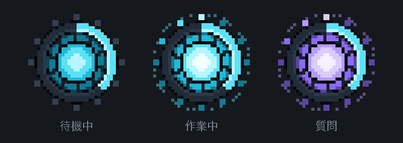
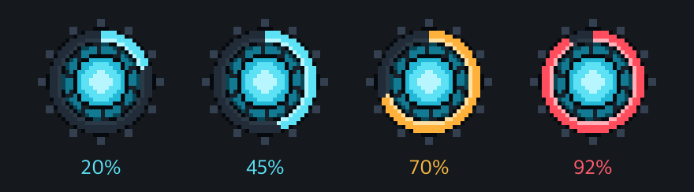
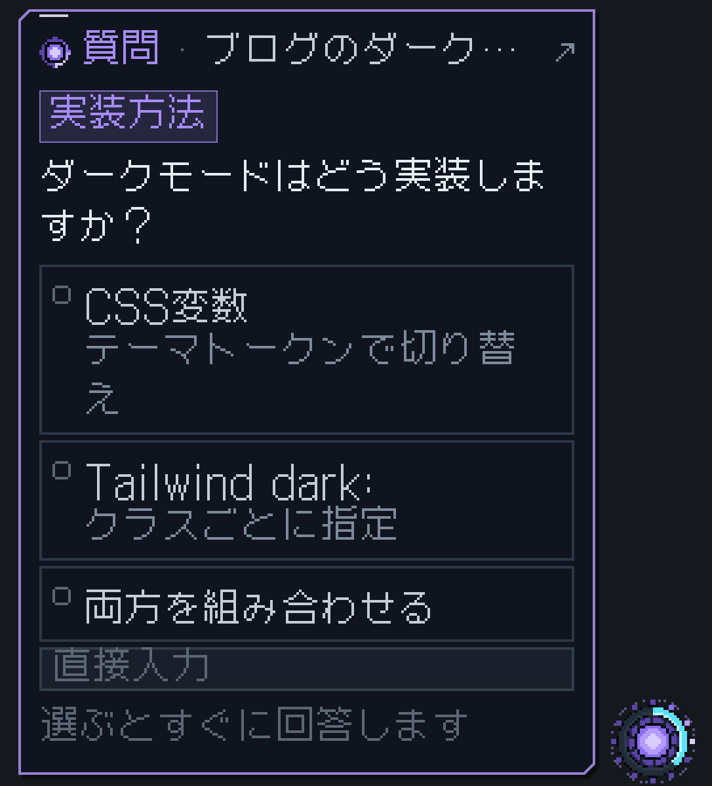
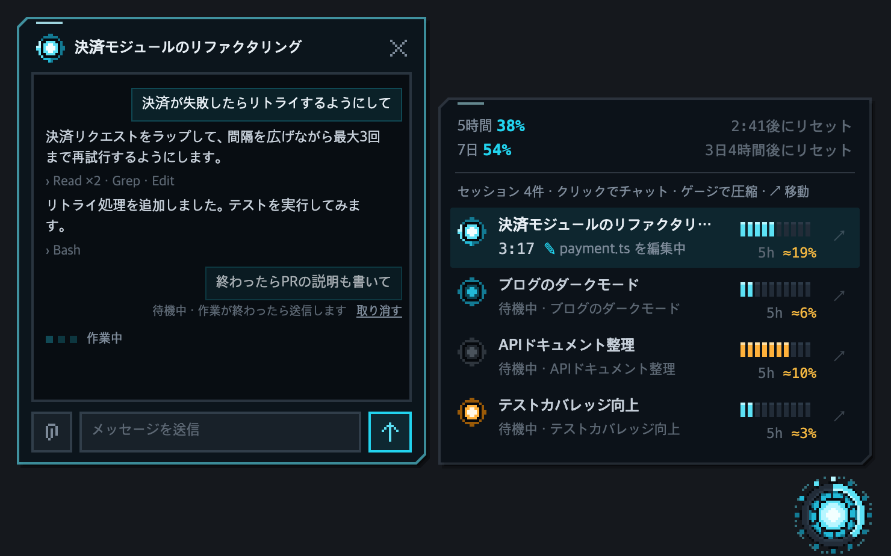
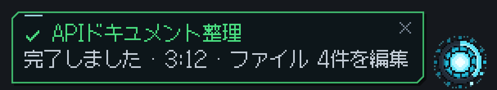
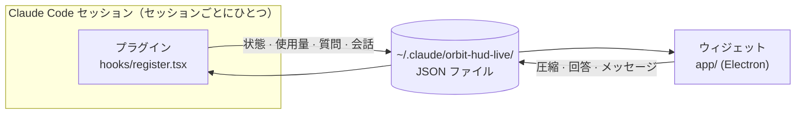

<div align="center">

[English](README.md) | [한국어](README.ko.md) | **日本語**



# ORBIT HUD

**複数の Claude Code セッションを、画面の隅のコアひとつで。**

ふだんはコアがひとつ浮かんでいるだけで、確認が必要なときだけカードがすっと出てきて戻っていく、<br>
ピクセルアートのフローティング HUD です。


[](LICENSE)

</div>

---

## なぜ作ったのか

Claude Code でセッションをいくつも動かしていると、こんなことが起こります。

- どのセッションが終わったのか、どのセッションが**質問して待っているのか**、ウィンドウをひとつずつ開かないとわかりません。
- 5 時間の使用量があとどれくらい残っているのか、**どのセッションが多く使ったのか**がわかりにくいです。
- コンテキストがいっぱいになりかけているのに気づかず、自動圧縮をくらってしまいます。

ORBIT HUD はこれらを**コアひとつ**で見せてくれます。必要なときだけ知らせ、回答や圧縮のようなちょっとした作業はアプリを開かずにその場で済ませられます。

## 機能

### ◉ コアひとつで状態を把握

| リング | 光 | 色 |
| --- | --- | --- |
| 5 時間の使用量に応じて満ちていき、60% で黄色、85% で赤に変わります | どれかのセッションが作業中なら、ランプが回って光ります | 誰かが質問すると紫色に変わります |

<p align="center"></p>

**リング = 5 時間の使用量。** 現在の 5 時間枠を使った分だけ、12 時の位置から時計回りに満ちていきます。何も開かなくても残りがひと目で分かります。60% 未満は青、60% から黄色、85% から赤です。5 時間枠がリセットされるとリングは空になり、また満ちていきます。アカウント全体の使用量なので、どのセッションで見ても同じです。

マウスを乗せると、5 時間・7 日間の使用量とリセット時刻を表示するカードが少しのあいだ出てきます。

### ? 質問にウィジェットから直接答える



Claude が選択式の質問をすると、コアが紫色に変わって質問カードが出てきます。

- 質問がひとつで、選ぶのもひとつだけなら、選択肢を**押した瞬間に**回答が送られます。
- 複数選べる質問は、チェックしてから「回答する」を押します。
- 質問が複数あるときは、1 枚ずつめくりながら答えます。
- 望む答えがなければ、直接入力できます。

アプリの質問画面と同時に表示されるので、どちらから答えてもかまいません。

<br clear="right">

### ▤ セッションパネルとチャット



コアをクリックすると、セッション一覧が開きます。

- **1 行サマリー：** 各セッションがいま何をしているか（`payment.ts を編集中`）を表示します。
- **コンテキストゲージ：** 数字ではなくマスで表示します。マウスを乗せると圧縮ボタンに変わり、1 回押すと圧縮します。
- **`5h ≈19%`：** 今回の 5 時間枠のうち、そのセッションが使った割合です。キャッシュトークンが安いことまで反映したコスト台帳で計算します。
- **`↗`：** アプリの該当セッションに移動します。
- **コアの色 = プロンプトキャッシュ：** セッションの前にある小さなコアがキャッシュの状態を知らせます。キャッシュが有効なら通常の色、期限切れまでの残り時間が保持時間（5 分 / 1 時間）の 1/5 を下回ると黄色、期限が切れるとグレーです。コアにマウスを乗せると、残り時間、期限切れ時に次のメッセージで新たに書き込まれる量（`次のメッセージで720k 全体をキャッシュに保存し直します`）、ヒット率（送った入力のうちキャッシュから読んだ割合）、リクエスト数・ミス数が表示されます。数値はセッションの会話記録ファイルから読み取ります。

セッションを押すと、パネルの横に**チャットカード**が開きます。最近の会話を見ながら、すぐにメッセージを送れます。

- 作業中のセッションに送ったメッセージは**待機**し、作業が終わると送られます。
- 待機中のメッセージは、そのあいだに**取り消し**できます。

### ✓ 必要なときだけ出る通知



- 作業が終わると緑のカードでお知らせします。押すとそのセッションに移動します。
- コンテキストや 5 時間の使用量が 85% を超えると、一度だけ警告します。
- 数秒後には、またコアの中に戻っていきます。

## 操作方法

| 操作 | 内容 |
| --- | --- |
| コアを**クリック** | セッションパネルを開く / 閉じる |
| コアを**ドラッグ** | 好きな場所へ移動（位置は記憶されます） |
| コアに**マウスを乗せる** | 使用量カードを表示 |
| コアを**右クリック**、またはパネルの **⚙** | コアのサイズ、言語、位置をリセット、隠す、ウィジェットを終了 |
| **`Ctrl` + `Alt` + `O`**（Mac: `Control` + `Option` + `O`） | どこからでもウィジェットを隠す / 表示する |
| `/hud on` · `/hud off` | Claude Code からウィジェットを表示する / 隠す |
| `/hud lang auto` · `en` · `ko` · `ja` | Claude Code から言語を変更する（`auto` はシステムの言語に従います） |
| セッション行を**クリック** | チャットカードを開く（`Enter` 送信 · `Shift+Enter` 改行 · `Esc` 閉じる） |

## インストール

**必要なもの：** Windows 10/11 または macOS、プラグインの関数フックに対応した Claude Code デスクトップアプリ、[Node.js](https://nodejs.org) 18 以上。

1. リポジトリを取得します。

   ```bash
   git clone https://github.com/Lab-Dawn/orbit-hud.git
   ```

2. `~/.claude/settings.json` の `env` にプラグインフォルダを登録し、関数フックを有効にします。

   ```json
   {
     "env": {
       "CLAUDE_CODE_PLUGIN_DIRS": "C:\\path\\to\\orbit-hud",
       "CLAUDE_CODE_ENABLE_FUNCTION_HOOKS": "1"
     }
   }
   ```

   Mac の場合は、パスを `/Users/<名前>/path/to/orbit-hud` のように書きます。

3. Claude Code を再起動すると、セッション開始時にコアが画面の右下に表示されます。

初回だけ、ウィジェットが使う Electron（約 100MB）を `~/.claude/orbit-hud-live/runtime` にダウンロードするため、1 分ほどかかります。プラグインフォルダには何もインストールしません。`git clone` で取得して使う方式なので、Mac でも開発者署名や個別の許可なしで実行できます。

ウィジェットとプラグインの画面は英語・韓国語・日本語に対応しています。既定では OS の言語に従い（対応していない言語の場合は英語）、パネルの ⚙ メニュー（コアの右クリックメニューと同じ）の「言語 (Language)」や `/hud lang` で自分で選ぶこともできます。

> コードを修正しながら使う場合は、`"CLAUDE_CODE_PLUGIN_DIR_WATCH": "1"` も追加しておいてください。保存するとすぐに再読み込みされます。

## 仕組み



- セッションごとに、プラグインが自分の状態を `sessions/<セッション id>.json` に書き込みます。ひとつのウィジェットがそれらのファイルを集めて表示します。
- ウィジェットで押した圧縮・回答・メッセージはファイルとして戻り、該当セッションのプラグインが受け取って処理します。
- やり取りはすべて自分のコンピューター内のファイルです。最初に Electron をダウンロードする以外、外部への通信はありません。

## トークンとプライバシー

- **ふだんはトークンを使いません。** 状態・使用量・会話記録は、Claude Code がすでに持っている値を読み取るだけです。モデルは呼び出しません。
- **トークンを使うのは、自分で押したときだけです。** 圧縮・チャットメッセージ・質問への回答は、アプリで同じことをしたときとまったく同じ量を使います。
- **会話の内容は自分のコンピューターにだけあります。** チャットカードが開いているときだけ、最近の会話をローカルファイルに書き出します。

## 注意点

- `5h ≈N%` は推定値です。Claude Code の外（Web、ほかのデバイス）で使った分は、セッションごとに分けられません。
- ウィジェットから送ったメッセージは、会話記録にプラグインが送ったものとして残ります。
- 待機中のメッセージはウィジェットのメモリにしかないため、ウィジェットを再起動すると消えます。

## 構成

| パス | 内容 |
| --- | --- |
| `hooks/register.tsx` | プラグイン：セッションの状態を書き出し、ウィジェットからのリクエスト（圧縮、回答、メッセージ）を処理 |
| `app/` | ウィジェット：ピクセルアートのコア、カード、パネル、チャット（Electron、Windows と macOS 共通） |
| `app/launch.js` | ウィジェットのランチャー：初回は Electron をインストールしてからウィジェットを起動します |
| `types/index.d.ts` | プラグインの状態の型 |
| `docs/tools/` | README の画像をダミーのデモセッションで撮り直すスクリプト |

## ライセンス

[MIT](LICENSE)。誰でも自由に使用・改変・再配布できます。著作権表示だけは残してください。

ドット文字に使っている [Galmuri](https://galmuri.quiple.dev) フォントは、SIL Open Font License 1.1 に従います（`app/fonts/Galmuri-OFL.txt`）。
