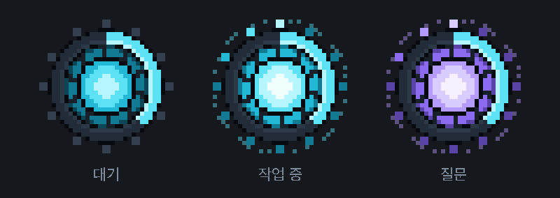
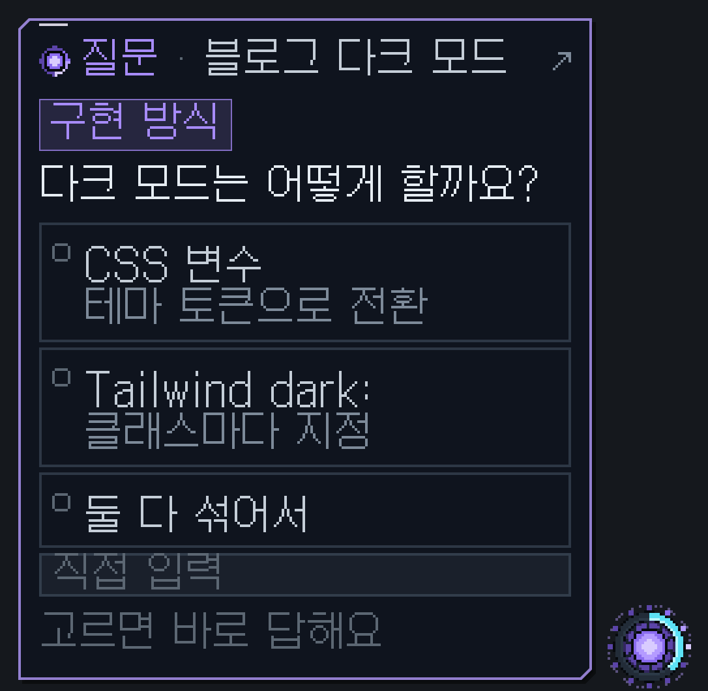
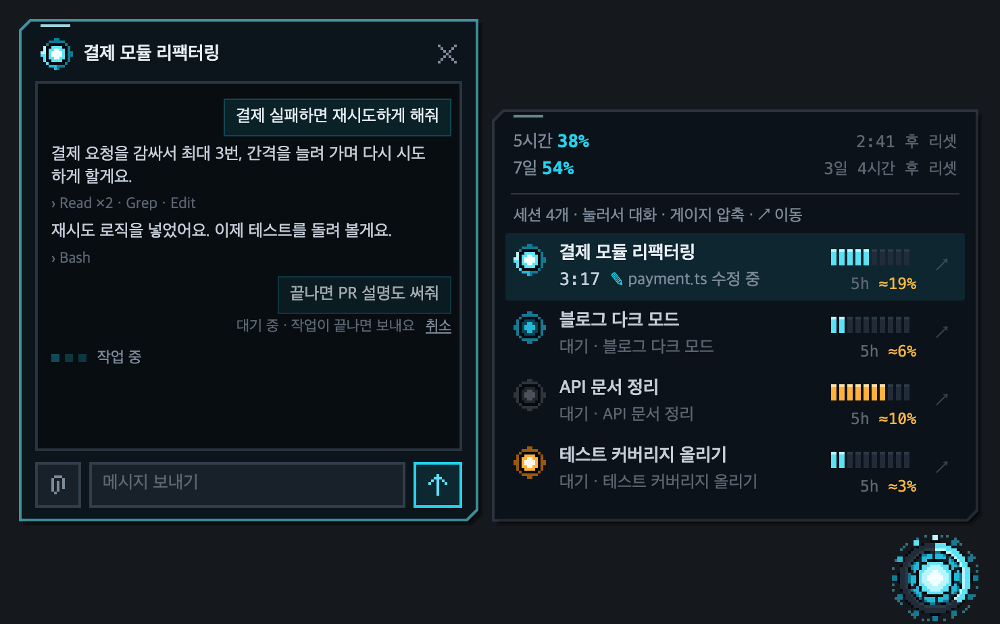
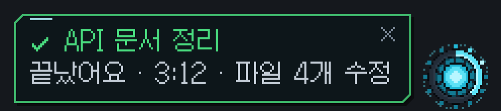
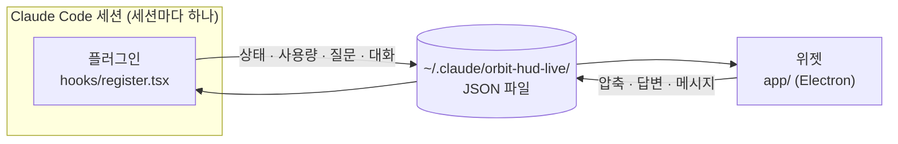

<div align="center">

[English](README.md) | **한국어** | [日本語](README.ja.md)



# ORBIT HUD

**Claude Code 세션 여러 개를, 화면 구석의 코어 하나로.**

평소엔 코어 하나만 떠 있다가, 확인할 일이 생길 때만 카드가 스르륵 나왔다 들어가는<br>
픽셀 아트 플로팅 HUD예요.


[](LICENSE)

</div>

---

## 왜 만들었나

Claude Code로 세션을 여러 개 돌리다 보면 이런 일이 생겨요.

- 어느 세션이 끝났는지, 어느 세션이 **질문하고 기다리는지** 창을 하나하나 열어 봐야 알아요.
- 5시간 사용량이 얼마나 남았는지, **어떤 세션이 많이 먹었는지** 알기 어려워요.
- 컨텍스트가 꽉 차 가는 걸 놓치고 있다가 자동 압축을 맞아요.

ORBIT HUD는 이걸 **코어 하나**로 보여 줘요. 필요한 순간에만 알려 주고, 대답이나 압축 같은 간단한 일은 앱을 열지 않고 그 자리에서 처리해요.

## 기능

### ◉ 코어 하나로 상태 파악

| 링 | 빛 | 색 |
| --- | --- | --- |
| 5시간 사용량만큼 차오르고, 60%면 노랑, 85%면 빨강으로 바뀌어요 | 어느 세션이든 작업 중이면 램프가 돌며 빛나요 | 누군가 질문하면 보라색으로 바뀌어요 |

<p align="center"></p>

**링 = 5시간 사용량.** 지금 5시간 창을 쓴 만큼 12시 방향에서 시계 방향으로 차올라요. 아무것도 열지 않아도 얼마나 남았는지 알 수 있어요. 60% 전까지는 파랑, 60%부터 노랑, 85%부터 빨강이에요. 5시간 창이 리셋되면 링이 비고 다시 차올라요. 계정 전체의 사용량이라 어느 세션에서 봐도 같아요.

마우스를 올리면 5시간·7일 사용량과 리셋 시각을 보여 주는 카드가 잠깐 나와요.

### ? 질문에 위젯에서 바로 답하기



Claude가 선택지 질문을 하면 코어가 보라색으로 바뀌고 질문 카드가 나와요.

- 질문이 하나이고 하나만 고르면 되면, 선택지를 **누르는 즉시** 답이 가요.
- 여러 개 고르는 질문은 체크한 뒤 "답하기"를 눌러요.
- 질문이 여러 개면 한 장씩 넘기며 답해요.
- 원하는 답이 없으면 직접 입력해요.

앱의 질문 창과 동시에 떠 있어서, 어느 쪽에서 답해도 돼요.

<br clear="right">

### ▤ 세션 패널과 채팅



코어를 클릭하면 세션 목록이 펼쳐져요.

- **한 줄 요약:** 각 세션이 지금 무엇을 하는지(`payment.ts 수정 중`) 보여 줘요.
- **컨텍스트 게이지:** 숫자 대신 칸으로 보여 줘요. 마우스를 올리면 압축 버튼으로 바뀌고, 한 번 누르면 압축해요.
- **`5h ≈19%`:** 이번 5시간 창에서 그 세션이 쓴 비중이에요. 캐시 토큰이 싼 것까지 반영한 비용 장부로 계산해요.
- **`↗`:** 앱의 해당 세션으로 이동해요.
- **코어 색 = 프롬프트 캐시:** 세션 앞의 작은 코어가 캐시 상태를 알려 줘요. 캐시가 유효하면 평소 색, 만료까지 남은 시간이 유지 시간(5분/1시간)의 1/5 아래면 노랑, 만료되면 회색이에요. 코어에 마우스를 올리면 남은 시간, 만료됐을 때 다음 메시지가 새로 저장할 양(`다음 메시지에서 720k 전체를 캐시에 새로 저장해요`), 적중률(보낸 입력 중 캐시에서 읽은 비율), 요청·놓침 횟수가 나와요. 숫자는 세션의 대화 기록 파일에서 읽어요.

세션을 누르면 패널 옆에 **채팅 카드**가 열려요. 최근 대화를 보고 바로 메시지를 보낼 수 있어요.

- 작업 중인 세션에 보낸 메시지는 **대기**했다가 작업이 끝나면 들어가요.
- 대기 중인 메시지는 그동안 **취소**할 수 있어요.

### ✓ 필요할 때만 나오는 알림



- 작업이 끝나면 초록 카드로 알려요. 누르면 그 세션으로 이동해요.
- 컨텍스트나 5시간 사용량이 85%를 넘으면 한 번 경고해요.
- 몇 초 뒤엔 다시 코어 속으로 들어가요.

## 조작법

| 동작 | 하는 일 |
| --- | --- |
| 코어 **클릭** | 세션 패널 열기 / 닫기 |
| 코어 **드래그** | 원하는 곳으로 옮기기 (위치는 기억해요) |
| 코어에 **마우스 올리기** | 사용량 카드 보기 |
| 코어 **우클릭**, 또는 패널의 **⚙** | 코어 크기, 언어, 위치 초기화, 숨기기, 위젯 종료 |
| **`Ctrl` + `Alt` + `O`** (맥: `Control` + `Option` + `O`) | 어디서든 위젯 숨기기 / 보이기 |
| `/hud on` · `/hud off` | Claude Code에서 위젯 켜기 / 숨기기 |
| `/hud lang auto` · `en` · `ko` · `ja` | Claude Code에서 언어 바꾸기 (`auto`는 시스템 언어를 따라요) |
| 세션 행 **클릭** | 채팅 카드 열기 (`Enter` 보내기 · `Shift+Enter` 줄바꿈 · `Esc` 닫기) |

## 설치

**필요한 것:** Windows 10/11 또는 macOS, 플러그인 함수 훅을 지원하는 Claude Code 데스크톱 앱, [Node.js](https://nodejs.org) 18 이상.

1. 저장소를 받아요.

   ```bash
   git clone https://github.com/Lab-Dawn/orbit-hud.git
   ```

2. `~/.claude/settings.json`의 `env`에 플러그인 폴더를 등록하고 함수 훅을 켜요.

   ```json
   {
     "env": {
       "CLAUDE_CODE_PLUGIN_DIRS": "C:\\path\\to\\orbit-hud",
       "CLAUDE_CODE_ENABLE_FUNCTION_HOOKS": "1"
     }
   }
   ```

   맥이라면 경로를 `/Users/<이름>/path/to/orbit-hud`처럼 써요.

3. Claude Code를 다시 시작하면 세션이 시작될 때 코어가 화면 오른쪽 아래에 떠요.

처음 한 번은 위젯이 쓰는 Electron(약 100MB)을 `~/.claude/orbit-hud-live/runtime`에 내려받느라 1분쯤 걸려요. 플러그인 폴더에는 아무것도 깔지 않아요. `git clone`으로 받아 쓰는 방식이라 맥에서도 개발자 서명이나 따로 허용할 것 없이 실행돼요.

위젯과 플러그인 화면은 한국어·영어·일본어를 지원해요. 기본은 운영체제 언어를 따르고(지원하지 않는 언어면 영어), 패널의 ⚙ 메뉴(코어 우클릭 메뉴와 같아요)의 "언어 (Language)"나 `/hud lang`으로 직접 고를 수도 있어요.

> 코드를 고치면서 쓸 거라면 `"CLAUDE_CODE_PLUGIN_DIR_WATCH": "1"`도 넣어 두세요. 저장하는 즉시 다시 불러와요.

## 동작 방식



- 세션마다 플러그인이 자기 상태를 `sessions/<세션 id>.json`에 써요. 위젯 하나가 그 파일들을 모아 보여 줘요.
- 위젯에서 누른 압축, 답변, 메시지는 파일로 돌아가고, 해당 세션의 플러그인이 받아서 처리해요.
- 주고받는 건 전부 내 컴퓨터 안의 파일이에요. 처음에 Electron을 내려받는 것 말고는 외부로 나가는 통신이 없어요.

## 토큰과 개인정보

- **평소엔 토큰을 쓰지 않아요.** 상태, 사용량, 대화 기록은 Claude Code가 이미 가진 값을 읽기만 해요. 모델을 부르지 않아요.
- **토큰을 쓰는 건 직접 누를 때뿐이에요.** 압축, 채팅 메시지, 질문 답변은 앱에서 같은 일을 할 때와 똑같은 양을 써요.
- **대화 내용은 내 컴퓨터에만 있어요.** 채팅 카드가 열려 있을 때만 최근 대화를 로컬 파일로 내보내요.

## 알아 둘 점

- `5h ≈N%`는 추정치예요. Claude Code 밖(웹, 다른 기기)에서 쓴 양은 세션별로 나눌 수 없어요.
- 위젯에서 보낸 메시지는 대화 기록에 플러그인이 보낸 것으로 남아요.
- 대기 중인 메시지는 위젯 메모리에만 있어서, 위젯을 다시 띄우면 사라져요.

## 구성

| 경로 | 내용 |
| --- | --- |
| `hooks/register.tsx` | 플러그인: 세션 상태를 내보내고 위젯의 요청(압축, 답변, 메시지)을 처리 |
| `app/` | 위젯: 픽셀 아트 코어, 카드, 패널, 채팅 (Electron, Windows와 macOS 공용) |
| `app/launch.js` | 위젯 실행기: 처음엔 Electron을 설치하고 위젯을 띄워요 |
| `types/index.d.ts` | 플러그인 상태 타입 |
| `docs/tools/` | README 이미지를 가짜 데모 세션으로 다시 찍는 스크립트 |

## 라이선스

[MIT](LICENSE). 누구나 자유롭게 쓰고, 고치고, 다시 배포해도 돼요. 저작권 표시만 남겨 주세요.

도트 글씨에 쓴 [갈무리](https://galmuri.quiple.dev) 글꼴은 SIL 오픈 폰트 라이선스 1.1을 따라요 (`app/fonts/Galmuri-OFL.txt`).
