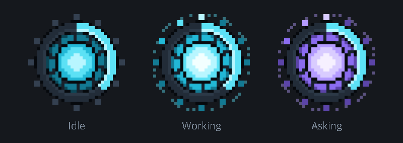
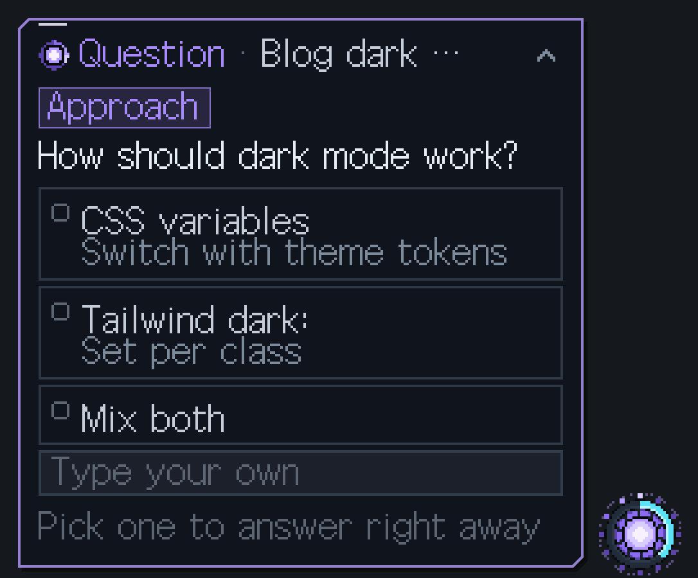
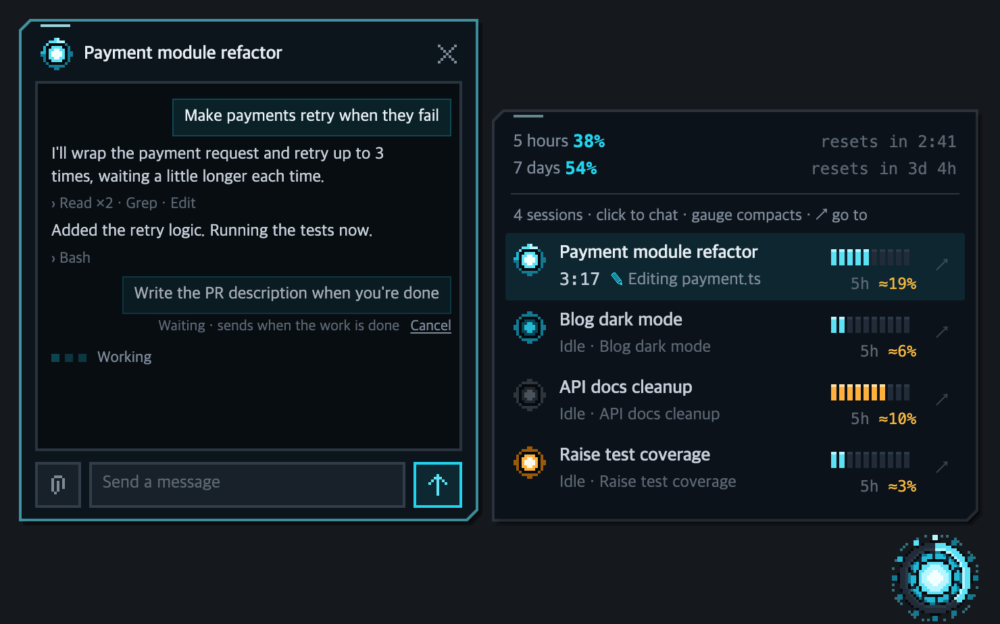
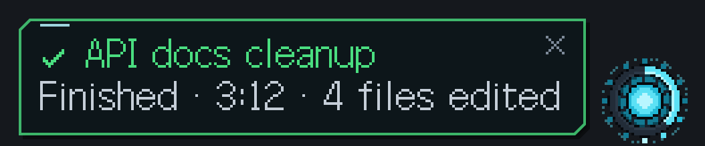
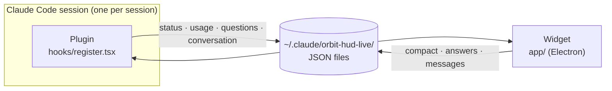

<div align="center">

**English** | [한국어](README.ko.md) | [日本語](README.ja.md)



# ORBIT HUD

**All your Claude Code sessions, in one core in the corner of your screen.**

A pixel-art floating HUD that stays a single core most of the time,<br>
and slides a card out only when there's something for you to check.


[](LICENSE)

</div>

---

## Why

Run several Claude Code sessions at once and this starts to happen:

- To see which session has finished, or which one is **asking a question and waiting**, you have to open each window.
- It's hard to tell how much of your 5-hour usage is left, or **which session used the most**.
- You miss the context filling up and get hit by auto-compaction.

ORBIT HUD shows all of this in **a single core**. It speaks up only when it matters, and handles small things like answering or compacting right there, without opening the app.

## Features

### ◉ Everything at a glance in one core

| Ring | Light | Color |
| --- | --- | --- |
| Fills up with your 5-hour usage, turning yellow at 60% and red at 85% | A lamp spins and glows while any session is working | Turns purple when someone asks a question |

<p align="center"></p>

**The ring is your 5-hour usage.** It fills clockwise from 12 o'clock as you use up the current 5-hour window, so you can tell how much is left without opening anything: blue below 60%, yellow from 60%, red from 85%. When the window resets, the ring empties and fills up again. It shows the whole account's usage, so it reads the same whichever session you're in.

Hover over it and a card briefly shows your 5-hour and 7-day usage and when they reset.

### ? Answer questions right from the widget



When Claude asks a multiple-choice question, the core turns purple and a question card appears.

- If there's one question with a single answer, your answer goes out **the moment you click** an option.
- For questions with multiple answers, tick your choices and press "Answer".
- If there are several questions, page through them one at a time.
- If the answer you want isn't listed, type your own.

It shows up alongside the app's own question prompt, so you can answer from either side. To answer in the app, press **`↗`** to open that session there (the card folds away), or **`⌃`** to fold the card down to a single line until you need it. A long question scrolls inside the card instead of running off the screen.

<br clear="right">

### ▤ Session panel and chat



Click the core to open the session list.

- **One-line summary:** shows what each session is doing right now (`Editing payment.ts`).
- **Context gauge:** shown as blocks instead of numbers. Hover over it and it turns into a compact button; one click compacts.
- **`5h ≈19%`:** that session's share of the current 5-hour window. It's calculated from a cost ledger that accounts for cheaper cached tokens.
- **`↗`:** jumps to that session in the app.
- **Core color = prompt cache:** the small core in front of each session shows its cache state. Normal color while the cache is valid, yellow when the time left before it expires drops below 1/5 of its lifetime (5 min / 1 h), and gray once it has expired. Hover over the core to see the time left, how much the next message will write to the cache from scratch once it has expired (`The next message writes all 720k of context to the cache again`), the hit rate (the share of input sent that was read from cache), and request and miss counts. The numbers come from the session's transcript file.

Click a session and a **chat card** opens next to the panel. You can read the recent conversation and send a message right away.

- A message sent to a session that's working **waits** and goes in once the work is done.
- You can **cancel** a waiting message in the meantime.

### ✓ Notifications only when needed



- When work finishes, a green card lets you know. Click it to jump to that session.
- When context or 5-hour usage passes 85%, you get a one-time warning.
- After a few seconds, it slips back into the core.

## Controls

| Action | What it does |
| --- | --- |
| **Click** the core | Open / close the session panel |
| **Drag** the core | Move it anywhere (the position is remembered) |
| **Hover** over the core | Show the usage card |
| **Right-click** the core, or **⚙** in the panel | Core size, Language, Reset position, Hide, Quit widget |
| **`Ctrl` + `Alt` + `O`** (Mac: `Control` + `Option` + `O`) | Hide / show the widget from anywhere |
| `/hud on` · `/hud off` | Show / hide the widget from Claude Code |
| `/hud lang auto` · `en` · `ko` · `ja` | Change the language from Claude Code (`auto` follows the system) |
| **Click** a session row | Open the chat card (`Enter` send · `Shift+Enter` new line · `Esc` close) |

## Installation

**Requirements:** Windows 10/11 or macOS, the Claude Code desktop app with plugin function hooks support, and [Node.js](https://nodejs.org) 18 or later.

1. Clone the repository.

   ```bash
   git clone https://github.com/Lab-Dawn/orbit-hud.git
   ```

2. Register the plugin folder under `env` in `~/.claude/settings.json` and turn on function hooks.

   ```json
   {
     "env": {
       "CLAUDE_CODE_PLUGIN_DIRS": "C:\\path\\to\\orbit-hud",
       "CLAUDE_CODE_ENABLE_FUNCTION_HOOKS": "1"
     }
   }
   ```

   On a Mac, write the path like `/Users/<name>/path/to/orbit-hud`.

3. Restart Claude Code, and the core appears in the bottom-right corner of your screen when a session starts.

The first time, it takes about a minute to download the Electron runtime the widget uses (about 100 MB) into `~/.claude/orbit-hud-live/runtime`. Nothing is installed into the plugin folder. Because you use it straight from a `git clone`, it runs on a Mac too without a developer signature or any extra approval.

The widget and plugin UI are available in English, Korean and Japanese. By default they follow your OS language (falling back to English), and you can pick one yourself from "Language" in the panel's ⚙ menu (also the core's right-click menu) or with `/hud lang`.

> If you'll be editing the code while you use it, also add `"CLAUDE_CODE_PLUGIN_DIR_WATCH": "1"`. Changes are reloaded the moment you save.

## How it works



- Each session's plugin writes its own state to `sessions/<session id>.json`. A single widget gathers those files and shows them.
- Compactions, answers and messages you trigger in the widget go back as files, and the plugin for that session picks them up and handles them.
- Everything exchanged is a file on your own computer. Apart from the initial Electron download, nothing goes out over the network.

## Tokens and privacy

- **It uses no tokens day to day.** Status, usage and transcripts are only read from values Claude Code already has. It never calls the model.
- **Tokens are spent only when you press something.** Compacting, chat messages and question answers use exactly as much as doing the same thing in the app.
- **Your conversations stay on your computer.** Recent conversation is exported to a local file only while a chat card is open.

## Good to know

- `5h ≈N%` is an estimate. Usage outside Claude Code (the web, other devices) can't be split by session.
- Messages sent from the widget are recorded in the transcript as sent by the plugin.
- Waiting messages live only in the widget's memory, so they're lost if the widget restarts.

## Layout

| Path | Contents |
| --- | --- |
| `hooks/register.tsx` | Plugin: exports session state and handles requests from the widget (compact, answers, messages) |
| `app/` | Widget: pixel-art core, cards, panel, chat (Electron, shared by Windows and macOS) |
| `app/launch.js` | Widget launcher: installs Electron the first time, then starts the widget |
| `types/index.d.ts` | Plugin state types |
| `docs/tools/` | Scripts that reshoot the README images using fake demo sessions |

## License

[MIT](LICENSE). Anyone is free to use, modify and redistribute it. Just keep the copyright notice.

The [Galmuri](https://galmuri.quiple.dev) font used for the pixel lettering is licensed under the SIL Open Font License 1.1 (`app/fonts/Galmuri-OFL.txt`).
